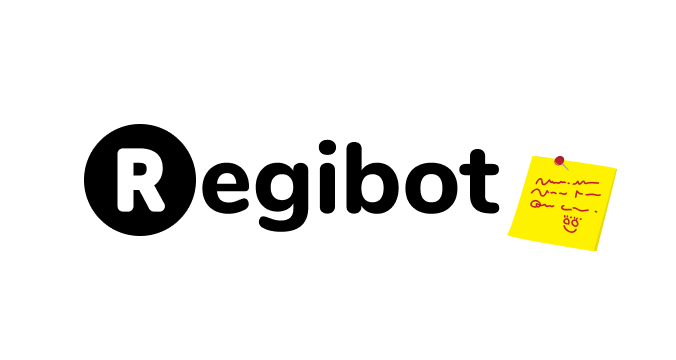

<p align="center">
 
</p>
<br/>

---

<p align="center">
 
  <a href="https://github.com/BeLazy167/RegiBot/network/members">
     
  </a>
  <a href="https://github.com/BeLazy167/RegiBot/stargazers">
    
  </a>
  <a href="https://github.com/BeLazy167/RegiBot/blob/final-push/LICENSE">
     
  </a>
</p>

---

# RegiBot
### Description
>
>A discord registration bot that can be used to register the participants in a specific tournament or competition reducing the work load for the admin.

---

## Setup your own bot and database
Read [setup.md](https://github.com/BeLazy167/RegiBot/blob/final-push/setup.md) for more information! 

---

### Get yourself a basic idea on how the Regibot works.
- #### Admin's End
  - As soon as the **server admin** adds Regibot to the server, the **bot itself** creates a text-channel named `events-schedule` which can only be seen by the **server owner** and **server admins**.
  - For Example, when the **server admins** or the **server owners** types the command `reg create Hackathon` where `reg` is the **prefix**, `create` is the command and `Hackathon` is the **event name** it will create a category named `Hackathon` which will contain different **text-channels** and **voice channel** related to the event which can be accessed by every member who wishes to participate.
- #### User's End 
    - Members will have to register themselves by typing the following command:
    `reg serverID, eventName, teamName, discordId, name, age, email`
    <!-- For Example:
    Leader's Info followed by teammates where teammates info will be continued after the leader's info separating with a ','
    `reg serverID, Hackathon, LaziX, discordId, Rutvik, 21, rj@gmail.com` -->
    - On succesful registration the **team leader** will receive a **random passcode** which can be used to **update** the team members or their info with the help of **team name** and **passcode** to avoid any confusions for the **admin**.

---

### Libraries Used
- Discord.py
>**[Discord.py](https://discordpy.readthedocs.io/en/latest/api.html#)** is a modern, easy to use, **feature-rich**, and async ready API wrapper for Discord.
> 
>Features:
  >- **Modern Pythonic API** using async/await syntax
  >- Sane rate limit handling that prevents 429s
  >- Implements the entire **Discord API**
  >- Command extension to aid with bot creation
  >- Easy to use with an object oriented design
  >- Optimised for both speed and memory

- pymongo
> **[PyMongo](https://docs.mongodb.com/drivers/pymongo/)** is a Python distribution containing tools for working with **MongoDB**, and is the recommended way to work with MongoDB from Python. This documentation attempts to explain everything you need to know to use **PyMongo**.

- Pandas
> **[pandas](https://pandas.pydata.org/pandas-docs/stable/)** is an **open source**, **BSD-licensed** library providing high-performance, easy-to-use data structures and data analysis tools for the Python programming language. We have used this library for converting **mongo** to **csv**.

---

## Contributing 

Contributions are what make the open source community such an amazing place to be learn, inspire, and create. Any contributions you make are greatly appreciated.

1. Fork the Project
2. Create your Feature Branch ``` git checkout -b feature/AmazingFeature```
3. Commit your Changes ``` git commit -m 'Add some AmazingFeature'```
4. Push to the Branch ``` git push origin feature/AmazingFeature```
5. Open a Pull Request

---

## Contributors
<a href="https://github.com/BeLazy167/RegiBot/graphs/contributors">
  
</a><br>


<br>
<h2 align="center">If you liked our work considering giving it a 🌟</h2>
<p align="center">
 
</p>
